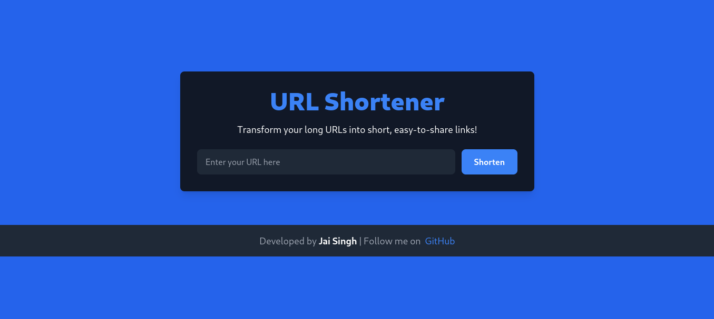

# 🔗 URL Shortener - A Fast and Simple URL Shortening Service

Welcome to the **URL Shortener** web application. This project allows users to shorten long URLs into more compact, shareable links. It's built with **React**, **Vite**, and **TailwindCSS**, and includes a powerful backend API that manages the URL shortening process.


## 🚀 Features

- 📏 **Shorten URLs**: Paste long URLs and instantly get a shorter, easy-to-share link.
- ⚡ **Fast and Lightweight**: Built with modern technologies (Vite + React), ensuring fast load times and seamless performance.
- 🌐 **Backend API Integration**: Fully functional backend API to handle URL shortening requests.
- 🎨 **Responsive UI**: Designed with **TailwindCSS**, providing a modern and responsive user experience.
- 🔒 **Environment Variable Configuration**: Base URL and other environment-sensitive data are securely managed through `.env`.

## 🎨 Screenshot

### Homepage - URL Shortener


### URL Shortened Result


## 📦 Installation

Follow the instructions below to get a local copy up and running.

### Prerequisites

- **Node.js** and **npm** or **yarn** must be installed on your machine. [Download Node.js](https://nodejs.org/)

### Clone the Repository

```bash
git clonehttps://github.com/JaiSinghRajput/UrlSHortner.git

cd UrlSHortner
# Install dependencies
npm install
# OR
yarn install
```
# environment setup
* add hosted backend Base Url on frontend environment variable 
```.env
VITE_BACKEND_URL= http://localhost:3030
PORT=5173
```

* add hosted frontend Base Url on backend environment variable for CORS ORIGIN
```.env
MONGO_URI= your mongo atlas url
PORT=3030
ORIGIN= frontend Url to share resources 
```
```bash
# Start the development server
npm run dev
# OR
yarn dev
```
Now, the application should be running at

 http://localhost:3030. (backend)
 
 http://localhost:5173. (frontend)


# 🔧 Technologies Used 

- Vite - Lightning-fast bundler
- React - JavaScript library for building user interfaces
- Tailwind CSS - Utility-first CSS   framework for rapid UI development
- Express (For backend API)
- Mongo DB for save the urls
- nanoid for generate unique short id 

# 🛠️ API Integration

The frontend is connected to a simple backend that handles URL shortening. The backend exposes an API endpoint where users can send the URL to be shortened:

    POST /api/url/: Accepts the original URL and returns the shortened version.
    GET /api/url/:shortid : redirect you to ypur original url


# 👨‍💻 Developer Info

This project was developed by Jai Singh Rajput. Check out my social profiles:

[Instagram](https://instagram.com/jaisingh._.rajput)
    
[GitHub](https://github.com/jaisinghrajput)

# 📄 License

This project is licensed under the MIT License.
